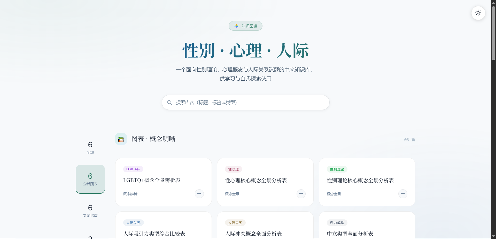
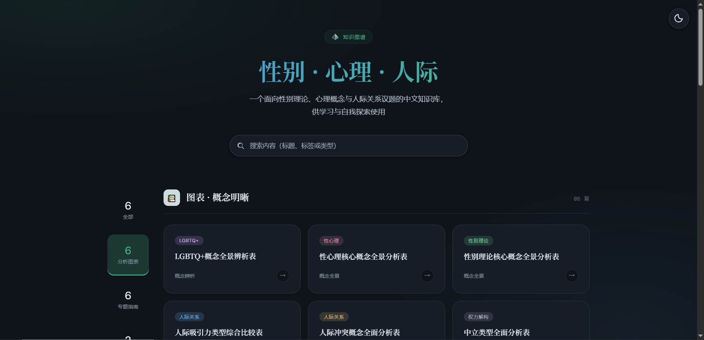

# PrismSelf

  

  <strong>性别 · 心理 · 人际</strong> 
  面向性别理论、心理概念与人际关系议题的中文知识库

## 项目简介

PrismSelf 是一个以静态网页形式呈现的中文知识库，围绕性别理论、心理概念与人际关系议题整理概念分析、专题指南、术语索引、社群记录、共鸣刻度、自评量表和关系沟通工具。

项目面向学习、检索、自我探索和个人理解辅助场景，可用于梳理概念脉络、比较不同经验与记录自己的思考，不用于替代医疗、心理、法律或其他专业服务。

## 功能概览

- 知识入口：[index.html](./index.html) 提供首页导航、站内搜索、最近更新和内容卡片。
- 主题分析：[Analyses](./Analyses) 收录概念辨析、理论图谱、类型比较和主题分析页面。
- 专题指南：[Guides](./Guides) 收录长篇科普指南和专题学习页面。
- 术语索引：[Glossaries](./Glossaries) 收录各类词汇介绍。
- 社群观察：[Topics](./Topics) 收录调查报告、专题对谈和社群经验观察页面。
- 共鸣刻度：[Bingos](./Bingos) 收录宾果类共鸣刻度和轻量互动页面。
- 自评量表：[Scales](./Scales) 收录用于个人探索的自评量表，结果仅作为自我理解参考。
- 关系工具：[Tools](./Tools) 收录关系需求、沟通偏好和个人梳理工具。

## 界面预览

  
   
  

## 使用方式

### 在线访问

访问 <https://prismself.pages.dev/>。

### 本地阅读

项目为静态网页，可直接用浏览器打开 [index.html](./index.html)。

## 隐私与数据

- 自评量表、关系工具和导出内容默认在浏览器本地处理。
- 本项目不要求注册账号，也不以知识库功能为目的收集访问者填写的个人结果。
- 如果主动截图、导出或分享页面结果，请先确认其中不包含不愿公开的信息。

## 内容边界

- 本项目内容仅供学习、自我探索和个人理解辅助，不构成医疗、心理、法律或其他专业建议。
- 页面中的自评量表、共鸣刻度和互动工具结果不能替代正式评估、诊断或专业支持。
- 涉及身份、社群和关系议题的内容以尊重差异、避免污名化和避免替读者下结论为原则。
- 术语解释会尽量保留必要语境；同一概念在不同学科、传统或社群中可能存在不同定义和用法。

## 许可协议

本知识库采用双许可：

- 代码与工程文件：MIT License，见 [LICENSE](./LICENSE)。
- 文档及网站预设内容：Creative Commons Attribution 4.0 International（CC BY 4.0），见 [LICENSE-CONTENT.md](./LICENSE-CONTENT.md)。

第三方资源以其原作者或原项目的许可证声明为准。

## 反馈与贡献

欢迎通过 [GitHub Issue](https://github.com/KrelinnBios/PrismSelf/issues) 提交错别字、排版兼容问题、概念解释补充、引用纠错或新内容建议。
